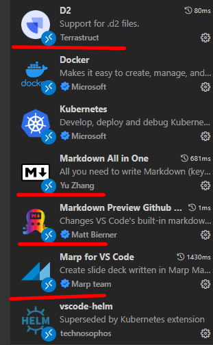
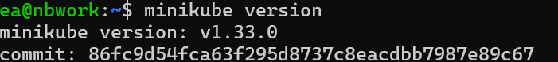
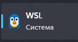
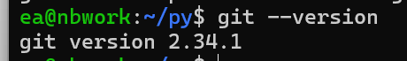
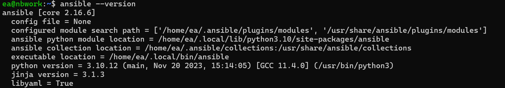
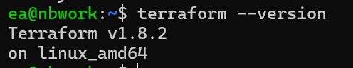
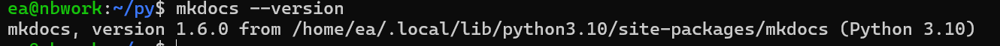
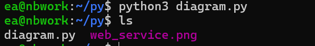
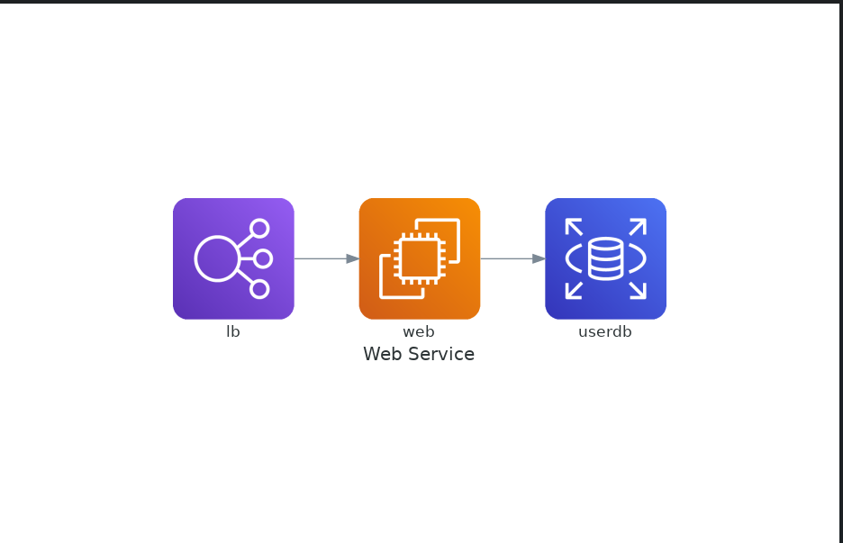

## 1. Настройка окружения
VSCode - *done*

MARP - *done*

D2 Lang - *done*

Minikube - *done*

WSL2 Ubuntu 20.04 - *done*

## Git

Ansible - *done*

Molecule - *done*

Terraform - *done*

## Дополнительное ПО

https://www.mkdocs.org/ - *done*

https://diagrams.mingrammer.com/docs/guides/diagram - *done*

